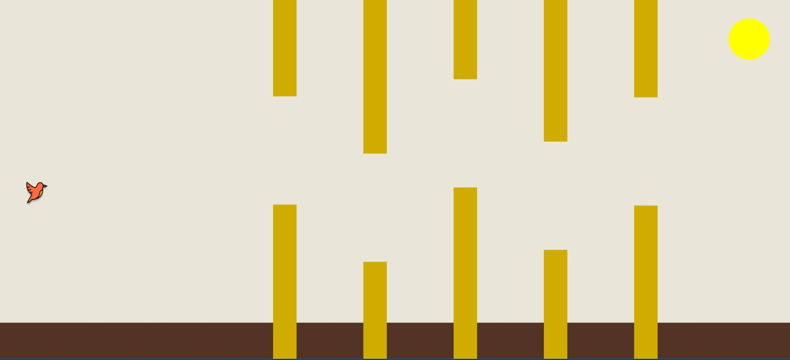

# WideBird Game

WideBird is a Kotlin Multiplatform game inspired by Flappy Bird, designed to support wide screens and work across multiple platforms, including Android, iOS, Web and Desktop. The game is built using Kotlin Multiplatform technology, ensuring a smooth experience on any device with consistent gameplay across all platforms.

## Project Structure

This project is organized to support shared code across different platforms and contains the following main directories:

- **`/composeApp`**: This contains the code that will be shared across all platforms for Compose Multiplatform applications. It includes several subfolders:
  - **`commonMain`**: Code common to all platforms.
  - **Platform-specific folders**: These contain Kotlin code specific to a given platform (e.g., `iosMain` for iOS-specific code, `androidMain` for Android, etc.). For example, if you need to call iOS-specific APIs like Apple's CoreCrypto, you would put those calls in the `iosMain` folder.

- **`/iosApp`**: This contains the iOS application code. Even if you're using Compose Multiplatform to share the UI, this entry point is required for the iOS app. You can also add SwiftUI code in this folder if necessary.

- **`/server`**: This folder contains the Ktor server application. It is used for the backend part of the game, managing multiplayer features or other server-side functionalities.

- **`/shared`**: This is where code that will be shared between all platforms resides. The most important folder here is `commonMain`, where platform-agnostic code goes. You can also add platform-specific code to the appropriate subfolders within `/shared`.

## Getting Started

To learn more about Kotlin Multiplatform, Compose Multiplatform, and Kotlin/Wasm, check out the following resources:

- [Kotlin Multiplatform Guide](https://www.jetbrains.com/help/kotlin-multiplatform-dev/get-started.html)
- [Compose Multiplatform Documentation](https://github.com/JetBrains/compose-multiplatform/#compose-multiplatform)
- [Kotlin/Wasm Information](https://kotl.in/wasm/)


## Running the Web Version
```shell
./gradlew :composeApp:wasmJsBrowserDevelopmentRun
```

## Running the Desktop Version
```shell
./gradlew :composeApp:run
```
